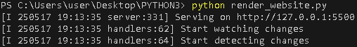

## Установка
Сделайте **fork** [репозитория с библиотекой](https://github.com/REFIORE/PYTHON3) и сохраните на компьютер. Python3 должен быть уже установлен. Если у вас его нет, то следуйте рекомендациям [статьи по установке Python для Windows.](https://docs.python.org/3/using/windows.html) Затем используйте ```pip``` (или ```pip3```, есть конфликт с Python2) для установки зависимостей:
```
pip isntall -r requirements.txt
```
## Запуск
Для запуска программы используйте команду в папке проекта:
```
python render_website.py
```
Вы увидите сообщение из консоли, что сайт запущен и готов к работе.


Протестировать запущенный сайт можно на сайте [127.0.0.1:5500](http://127.0.0.1:5500/)

## Как открыть страницу в оффлайн-режиме
Вам нужно найти папку ```pages```, открыть её и выбрать любой из ```index.html``` файлов. Чтобы перейти на страницу, нужно открыть выбранный вами файл.
## Цель проекта
Код написан в образовательных целях на онлайн-курсе для веб-разработчиков [dvmn.org](https://dvmn.org/)